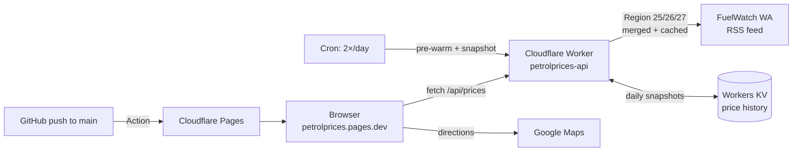

<div align="center">

# PetrolPrices

### The cheapest petrol in Perth, right now.

A fast, beautiful web app that answers one question — *where do I fill up today?* — using live
[FuelWatch WA](https://www.fuelwatch.wa.gov.au) data, ranked by a price‑first, distance‑aware score.

[**▶ Live site → petrolprices.pages.dev**](https://petrolprices.pages.dev)

[](https://petrolprices.pages.dev)
[](https://github.com/ningchoi-dev/petrolprices/actions/workflows/deploy.yml)


</div>

---

## Contents

- [What it is](#what-it-is)
- [Features](#features)
- [How it works](#how-it-works)
- [Architecture](#architecture)
- [API reference](#api-reference)
- [Project structure](#project-structure)
- [Tech stack](#tech-stack)
- [Local development](#local-development)
- [Deployment](#deployment)
- [Data & attribution](#data--attribution)
- [Roadmap](#roadmap)
- [Contributing](#contributing)
- [License](#license)

---

## What it is

PetrolPrices is a single‑page web app for Western Australian drivers. It opens with a cinematic
near‑black hero, then flips to a warm, scannable app surface where the **cheapest fuel near you is
huge and immediate**. Pick a fuel type, search your suburb (or share your location), compare today
vs tomorrow, open any station for its price trend, and tap straight through to Google Maps
directions.

It's built as **one static HTML page** talking to a **Cloudflare Worker** that proxies the
CORS‑blocked FuelWatch RSS feed into clean, cached JSON. No framework, no build step — yet.

> **Status:** live on real data. The only modelled element is the per‑station chart shape (see
> [How it works](#price-history)); everything else — prices, ranking, distances, the today‑vs‑tomorrow
> signal — is real.

## Features

- **Cheapest near you** — every metro station ranked by a price‑first, distance‑aware score, not just raw price.
- **6 fuel types** — ULP 91, Premium 95, Premium 98, Diesel, LPG, E85 (FuelWatch product codes).
- **Today / Tomorrow** — WA posts tomorrow's prices at 2:30pm; the app shows both and tells you whether to fill up now or wait.
- **Suburb search + geolocation** — suburb centroids are derived from the live station data, with curated fallbacks for outer suburbs that have no station of their own (e.g. *Aubin Grove → Piara Waters, 3.7 km*).
- **Per‑station price chart** — the WA weekly cycle with the station's real current price marked; hover any day.
- **Google Maps directions** — one tap launches turn‑by‑turn from your current location.
- **Track a station** — bell a station to (eventually) be alerted when it hits the bottom of the cycle.
- **Editorial design system** — Newsreader / Hanken Grotesk / Space Mono, a single vermillion accent, warm neutrals, motion that "settles like ink." Respects `prefers-reduced-motion`.

## How it works

### Cheapest, not just nearest

Raw "cheapest in Perth" is useless if it's a 40‑minute drive. PetrolPrices ranks by an **effective
price**:

```
score = price + 0.7¢/L × max(0, distance_km − 3)
```

Anything within ~3 km competes on price alone; beyond that, each extra kilometre adds ~0.7¢/L of
"effective" cost — roughly the consumer break‑even between fuel saved and fuel/time burned getting
there. So a station has to be *genuinely* cheaper to be worth a longer drive.

### The WA price cycle

Perth fuel runs on a weekly cycle: prices spike on **Thursday**, then ease down to a low early the
following week. FuelWatch publishes **today and tomorrow** only, so the app compares the two to
surface a real *"fill up today / you could wait"* signal.

### Suburbs without a station

FuelWatch returns each station's coordinates, so the app never has to match your suburb to a
station's suburb — it ranks the **whole metro by distance from your location**. Suburb centroids are
built by averaging station coordinates per suburb (covering every suburb that has a station), with a
small curated list for station‑less outer suburbs. Result: searching *Aubin Grove* just finds the
nearest stations in Success / Jandakot / Piara Waters, with a clear "no stations here — nearest is…"
note.

### Price history

FuelWatch exposes no historical API, so a real 4‑week per‑station series doesn't exist. The card
chart therefore draws the **documented WA weekly cycle**, anchored on the station's **real current
price** (the marked "Today" point; earlier days are estimates, shown with a `~`). Meanwhile the
Worker snapshots the real cheapest‑per‑day per fuel into KV (via cron *and* live traffic), so a real
metro history is accruing for a future area‑trend view.

## Architecture



- **Pages** serves the static page (auto‑deployed from `main` by a GitHub Action).
- **Worker** fetches the three Perth‑metro FuelWatch regions (25 North, 26 South, 27 Hills/Swan) in
  parallel, merges/dedupes (~450 stations), and returns CORS‑open JSON with a 1‑hour edge cache.
- **Cron** (after midnight and after the 2:30pm post, AWST) pre‑warms the cache and records the
  daily cheapest‑per‑fuel into **KV**.

## API reference

Base URL: `https://petrolprices-api.ningchoi02.workers.dev`

| Endpoint | Params | Description |
| --- | --- | --- |
| `GET /api/prices` | `product` (code), `day` (`today`\|`tomorrow`) | All metro stations for a fuel, cheapest first. |
| `GET /api/history` | `product` (code) | Recorded cheapest‑per‑day points (accruing). |
| `GET /api/meta` | – | Product codes, region, endpoint list. |

**Product codes:** `1` ULP 91 · `2` Premium 95 · `6` Premium 98 · `4` Diesel · `5` LPG · `10` E85

<details>
<summary><code>GET /api/prices?product=1&day=today</code> — example response</summary>

```json
{
  "product": "1",
  "productLabel": "ULP 91",
  "day": "today",
  "region": "Perth metro",
  "count": 447,
  "updated": "2026-06-01T04:22:23.914Z",
  "cheapest": { "brand": "Vibe", "trading": "Vibe Oakford", "suburb": "OAKFORD",
                "address": "...", "price": 162.5, "lat": -32.16, "lng": 115.88, "date": "2026-06-01" },
  "stations": [ /* …all stations, sorted by price… */ ]
}
```

`day=tomorrow` returns `count: 0` until FuelWatch posts (~2:30pm AWST). `cheapest` is then `null`.
</details>

## Project structure

```
petrolprices/
├── index.html                  # the whole front-end (HTML + CSS + JS, no build step)
├── tokens.css                  # design tokens (colour, type, spacing, motion)
├── design.md                   # the design system / brand guide
├── CLAUDE.md                   # original product brief
├── worker/
│   ├── src/index.ts            # the Cloudflare Worker (FuelWatch proxy + cron + KV)
│   └── wrangler.toml           # Worker config: cron triggers, KV binding
└── .github/workflows/deploy.yml  # CI: deploy the page to Pages on push to main
```

## Tech stack

| Layer | Choice |
| --- | --- |
| Front end | Vanilla HTML/CSS/JS, single file. Fonts + [Phosphor icons](https://phosphoricons.com) via CDN. |
| Hosting | [Cloudflare Pages](https://pages.cloudflare.com) (static) |
| API | [Cloudflare Workers](https://workers.cloudflare.com) + [Workers KV](https://developers.cloudflare.com/kv/) |
| Data | [FuelWatch WA](https://www.fuelwatch.wa.gov.au) RSS feed |
| CI | GitHub Actions → `cloudflare/wrangler-action` |

## Local development

```bash
# Front end — any static server
python3 -m http.server 4178      # → http://localhost:4178  (talks to the live Worker)

# Worker
cd worker
npx wrangler dev                 # local Worker at http://localhost:8787
npx wrangler dev --test-scheduled  # exercise the cron handler
```

## Deployment

**Front end (automatic):** every push to `main` runs `.github/workflows/deploy.yml`, which deploys
`index.html` to Cloudflare Pages. Requires two repo secrets:

| Secret | Value |
| --- | --- |
| `CLOUDFLARE_API_TOKEN` | API token with **Account → Cloudflare Pages → Edit** |
| `CLOUDFLARE_ACCOUNT_ID` | your Cloudflare account ID |

**Front end (manual):**

```bash
mkdir -p dist && cp index.html manifest.webmanifest sw.js icon.svg dist/
npx wrangler pages deploy dist --project-name=petrolprices --branch=main
```

**Worker:**

```bash
cd worker && npx wrangler deploy
```

## Data & attribution

Fuel price data is sourced from **[FuelWatch WA](https://www.fuelwatch.wa.gov.au)**, the official
Western Australian Government fuel‑price service. FuelWatch's terms require visible attribution and a
link back, which the app footer and this README provide. PetrolPrices is an independent project and
is not affiliated with or endorsed by FuelWatch or the WA Government. **Always confirm the price at
the pump.**

## Roadmap

- [x] Cloudflare Worker proxy for FuelWatch (cache + cron)
- [x] Full metro coverage (regions 25/26/27) with coords + data‑derived suburb centroids
- [x] Live wiring: real prices, ranking, suburb search, today‑vs‑tomorrow signal
- [x] Real daily history accruing in KV (cron + live traffic)
- [ ] Real per‑area history view once enough days have accrued (replace the modelled cycle)
- [ ] Price‑drop alerts for tracked stations (the bell)
- [ ] Map screen (React Leaflet) and richer history screen
- [ ] Migrate to the Vite + React + TypeScript structure from the brief
- [x] Installable PWA (manifest, icon, offline shell)
- [ ] Custom domain

## Contributing

Issues and PRs welcome. For changes to the page, edit `index.html`; for the API, edit `worker/`.
Keep the design system in [`design.md`](design.md) as the source of truth, and don't hard‑code
colours — use the tokens in [`tokens.css`](tokens.css).

## License

[MIT](LICENSE) © ningchoi‑dev. Fuel data © FuelWatch WA (see [attribution](#data--attribution)).
